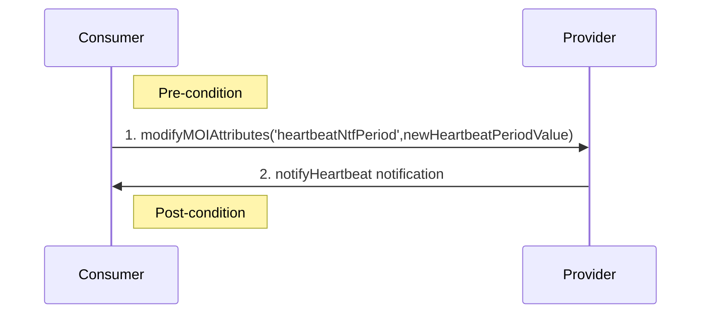
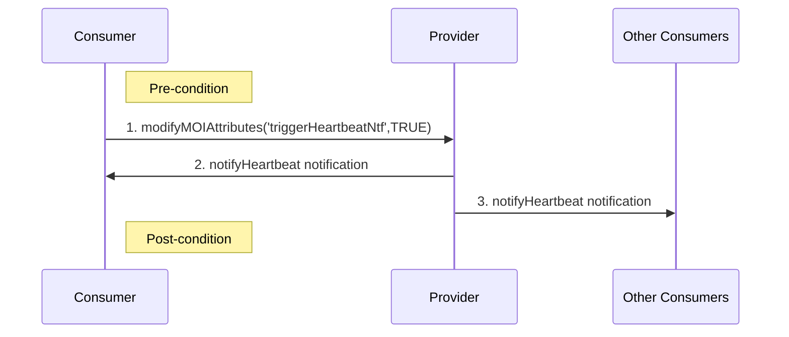
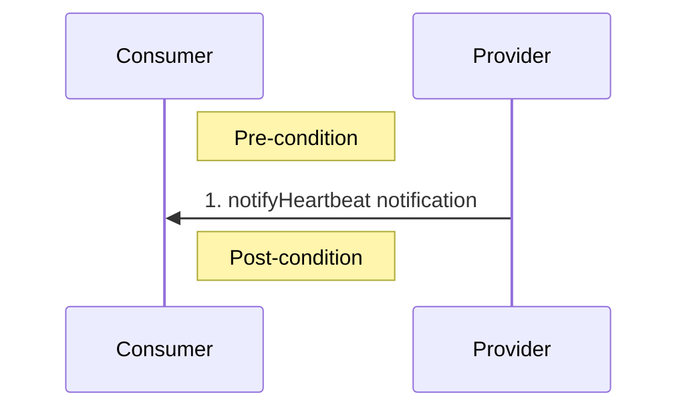

## 2.2. Heartbeat Management Services
Heartbeat MnS *Provider* sends asynchronous heartbeat notifications to Heartbeat MnS *Consumer* at a configurable frequency to allow Heartbeat MnS *Consumer* to supervise the connectivity to the Heartbeat MnS *Provider*.

### 2.2.1. Procedure for configuring heartbeat notification periodicity

Pre-condition:
- The periodicity has a valid value.

Procedure:
- The MnS *consumer* sends a request to the MnS *provider* to set the periodicity.
- The MnS *provider* receives the request and sets its internal countdown timer to a value equal to periodicity value.
- The MnS *provider* sends a heartbeat notification to all authorized MnS *consumers*.

Post-condition:
- The notification periodicity has been configured.

### 2.2.2. Procedure for requesting immediate heartbeat notification

Pre-condition:
- N/A

Procedure:
- The MnS *consumer* sends a request to the MnS *provider* to emit a heartbeat notification immediately.
- The MnS *provider* receives the request and sends a heartbeat notification to all authorized MnS *consumers* immediately.

Post-condition:
- The immediate heartbeat notification has been emitted.

### 2.2.3. Procedure for notifying periodic heartbeat notifications

Pre-condition:
- N/A

Procedure:
- The internal MnS *provider* has reached the value 0.
- The MnS *provider* sends a heartbeat notification to all authorized MnS *consumers*.
- The MnS *provider* resets its internal countdown timer to the heartbeat periodicity value.

Post-condition:
- The periodic heartbeat notification has been emitted to all authorized MnS *consumers*.

The following table describes the parameters of  notifyHeartbeat event:

| Parameter Name | Support Qualifier | Information Type |
| -------- | :--------: | -------- |
| objectClass | M | ManagedEntity.objectClass |
| objectInstance | M | ManagedEntity.objectInstance |
| eventTime | M | Date Time |
| notificationId | M | Notification Identifier |
| systemDN | CM | DN of MnS producers |
| heartbeatNtfPeriod | M | Value of ManagedEntity. heartbeatNtfPeriod |

# References
- [O-RAN.WG3.O1-Interface-for-Near-RT-RIC-R003-v01.00](https://orandownloadsweb.azurewebsites.net/specifications)
- [O-RAN.WG5.O-DU-O1.0-R003-v07.00](https://orandownloadsweb.azurewebsites.net/specifications)
- [O-RAN.WG5.O-CU-O1.0-R003-v05.00](https://orandownloadsweb.azurewebsites.net/specifications)
- [O-RAN.WG10.O1-Interface.0-R003-v10.00](https://orandownloadsweb.azurewebsites.net/specifications)
- [O-RAN.WG10.OAM-Architecture-R003-v09.00](https://orandownloadsweb.azurewebsites.net/specifications)
- [3GPP TS 28.537 version 17.2.0 Release 17](https://www.etsi.org/deliver/etsi_ts/128500_128599/128537/17.02.00_60/ts_128537v170200p.pdf)
- [3GPP TS 28.532 version 16.4.0 Release 16](https://www.etsi.org/deliver/etsi_ts/128500_128599/128532/16.04.00_60/ts_128532v160400p.pdf)
- [3GPP TS 28.545 version 16.1.0 Release 16](https://www.etsi.org/deliver/etsi_ts/128500_128599/128545/16.01.00_60/ts_128545v160100p.pdf)
