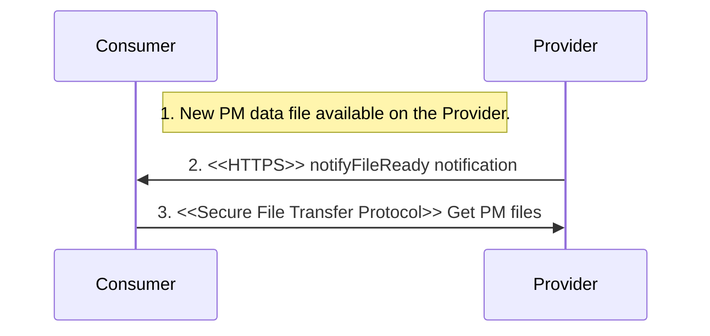
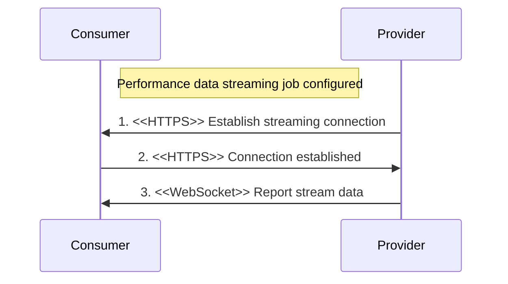

## 2.4. Performance Assurance Management Services

### 2.4.1. Performance Data File Reporting
Performance Assurance MnS *Provider* sends asynchronous FileReady notification event to Performance Assurance MnS *Consumer* to retrieve the Performance Management (PM) files.

Procedure:
- A new PM data file is available on the Performance Assurance MnS *Provider*.
- Performance Assurance MnS *Provider* sends notifyFileReady notification to Performance Assurance MnS *Consumer* over HTTP/TLS.
- Performance Assurance MnS *Consumer* sets up a secure file transfer protocol connection to the location specified in the notifyFileReady notification and gets the PM data files.

The following table describes the parameters of  notifyFileReady:

| Parameter Name | Support Qualifier | Information Type |
| -------- | :--------: | -------- |
| objectClass | M | It indicates the class |
| objectInstance | M | Identifier of the performance data reporting |
| objectInstance | M | Identifier of the performance data reporting |
| notificationId | M | Identifier of the notification |
| eventTime | M | The event occurence time |
| notificationType | M | "notifyFileReady" |
| fileInfoList | M | List of struct that specifies the information of each available file |
| additionalText | O | Additional information for this notification |

### 2.4.2. Performance Data Streaming
Performance Assurance MnS *Provider* streams high volume asynchronous streaming performance measurement data to Performance Assurance MnS *Consumer* at a configurable frequency.

Pre-condition:
- Performance Assurance MnS *Provider* is configured to produce PerfMetricJob to be delivered via streaming PM to the Performance Assurance *Consumer*.

Procedure:
- Performance Assurance MnS *Provider* requests to establish a WebSocket connection to begin streaming PM data.
- Performance Assurance *Consumer* accepts the request to upgrade the connection to a WebSocket.
- Performance Assurance MnS *Provider* transmits binary encoded data to *consumer* while performance job is active.

The following table describes the parameters of establishStreamingConnection operation:

| Parameter Name | Support Qualifier | Information Type |
| -------- | :--------: | -------- |
| producerId | M | Identifier of the producer |
| streamInfoList | M | List of StreamInfo |
| connectionId | M | Identifier of streaming connection |
| status | M | Success, Failure |

The following table describes the parameters of terminateStreamingConnection operation:

| Parameter Name | Support Qualifier | Information Type |
| -------- | :--------: | -------- |
| connectionId | M | Identifier of streaming connection |
| status | M | Success, Failure |

The following table describes the parameters of reportStreamData operation:

| Parameter Name | Support Qualifier | Information Type |
| -------- | :--------: | -------- |
| connectionId | M | Identifier of streaming connection |
| streamingData | M | Unit of streaming data |
| status | M | Success, Failure |

# References
- [O-RAN.WG3.O1-Interface-for-Near-RT-RIC-R003-v01.00](https://orandownloadsweb.azurewebsites.net/specifications)
- [O-RAN.WG5.O-DU-O1.0-R003-v07.00](https://orandownloadsweb.azurewebsites.net/specifications)
- [O-RAN.WG5.O-CU-O1.0-R003-v05.00](https://orandownloadsweb.azurewebsites.net/specifications)
- [O-RAN.WG10.O1-Interface.0-R003-v10.00](https://orandownloadsweb.azurewebsites.net/specifications)
- [O-RAN.WG10.OAM-Architecture-R003-v09.00](https://orandownloadsweb.azurewebsites.net/specifications)
- [3GPP TS 28.537 version 17.2.0 Release 17](https://www.etsi.org/deliver/etsi_ts/128500_128599/128537/17.02.00_60/ts_128537v170200p.pdf)
- [3GPP TS 28.532 version 16.4.0 Release 16](https://www.etsi.org/deliver/etsi_ts/128500_128599/128532/16.04.00_60/ts_128532v160400p.pdf)
- [3GPP TS 28.545 version 16.1.0 Release 16](https://www.etsi.org/deliver/etsi_ts/128500_128599/128545/16.01.00_60/ts_128545v160100p.pdf)
