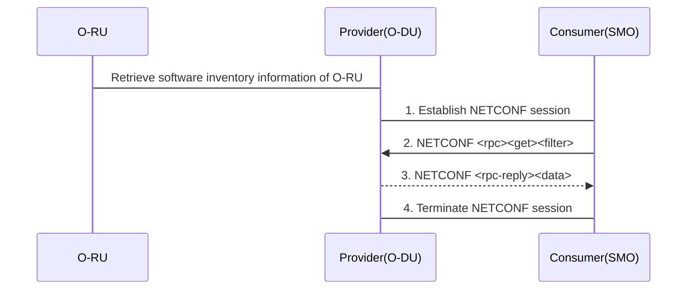
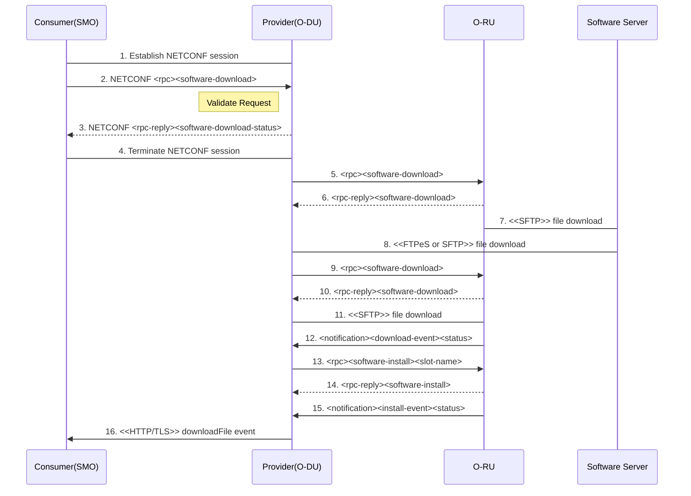

## 2.7. O-RU Software Management
### 2.7.1. Software Inventory
The SMO retrieves the software inventory information of O-RU.

Procedure:
- SMO establshes NETCONF session with O-DU.
- O-DU receives NETCONF [rpc][get][filter] from SMO to retrieve information of software slot of O-RU.
- O-DU returns requested data to SMO in NETCONF [rpc-reply] response.
- SMO terminates NETCONF session with O-DU.

### 2.7.2. Software Download

Procedure:
- SMO establishes NETCONF session with O-DU.
- SMO sends NETCONF [rpc][software-download][remote-file-path][softwarePackage] to trigger a download of the software and to identify the target O-RU.
- O-DU returns NETCONF [rpc-reply][software-download-status].
- SMO terminates NETCONF session with O-DU.
- Alternative 1: O-RU directly downloads the software package from software server.
  - O-DU sends [rpc>][software-download] toward O-RU.
  - O-RU returns [rpc-reply][software-download].
  - O-RU downloads the software package.
- O-DU sends [rpc][software-download] toward O-RU.
- O-RU returns [rpc-reply][software-download].
- O-RU downloads the software package.
- O-RU sends [notification][download-event] to notify the result of download process.
- O-DU sends [rpc][software-install] to perform the software install for O-RU.
- O-RU returns [rpc-reply][software-install].
- O-RU sends [notification][install-event] to notify the result of install process.
- When download operation is completed, O-DU sends download-event NETCONF downloadFile notification to SMO with the final status of the download (success or the reason for failure).

# References
- [O-RAN.WG3.O1-Interface-for-Near-RT-RIC-R003-v01.00](https://orandownloadsweb.azurewebsites.net/specifications)
- [O-RAN.WG5.O-DU-O1.0-R003-v07.00](https://orandownloadsweb.azurewebsites.net/specifications)
- [O-RAN.WG5.O-CU-O1.0-R003-v05.00](https://orandownloadsweb.azurewebsites.net/specifications)
- [O-RAN.WG10.O1-Interface.0-R003-v10.00](https://orandownloadsweb.azurewebsites.net/specifications)
- [O-RAN.WG10.OAM-Architecture-R003-v09.00](https://orandownloadsweb.azurewebsites.net/specifications)
- [3GPP TS 28.537 version 17.2.0 Release 17](https://www.etsi.org/deliver/etsi_ts/128500_128599/128537/17.02.00_60/ts_128537v170200p.pdf)
- [3GPP TS 28.532 version 16.4.0 Release 16](https://www.etsi.org/deliver/etsi_ts/128500_128599/128532/16.04.00_60/ts_128532v160400p.pdf)
- [3GPP TS 28.545 version 16.1.0 Release 16](https://www.etsi.org/deliver/etsi_ts/128500_128599/128545/16.01.00_60/ts_128545v160100p.pdf)
