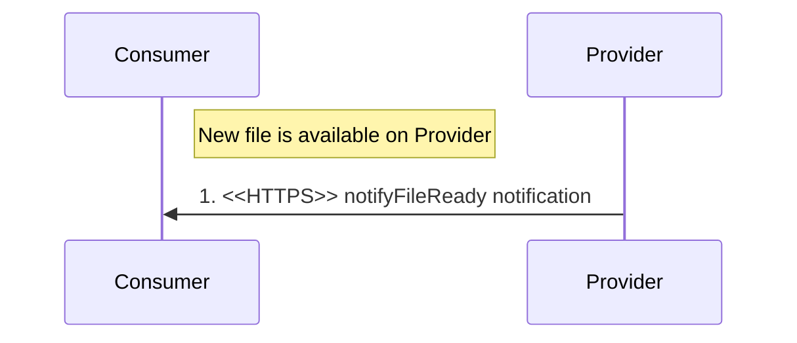
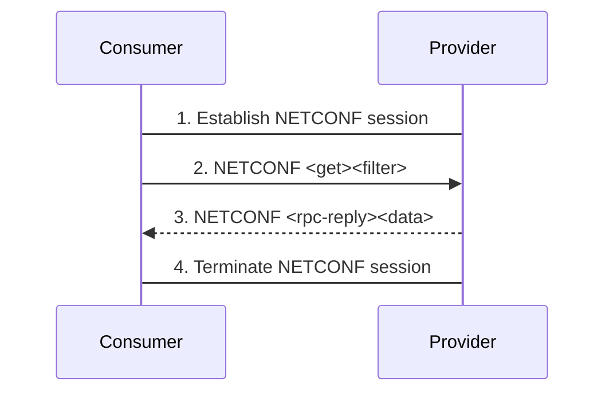
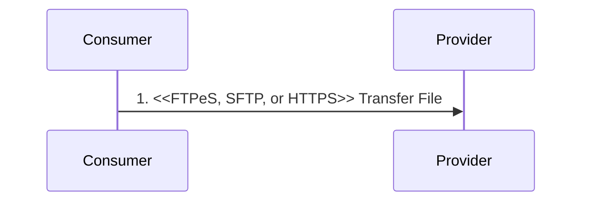
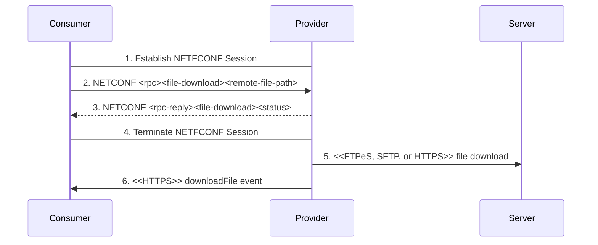
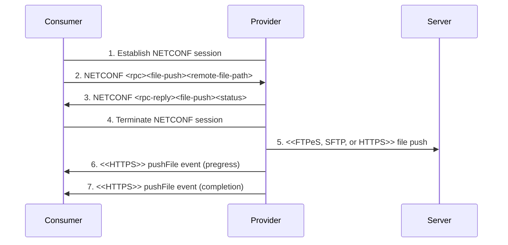

## 2.5. File Management Services

### 2.5.1. File Ready Notification
The File Ready Notification notifies a File Management MnS *Consumer* that a file is available for retrieval from the File Management MnS *Provider*.

Pre-condition:
- A new file is available on the File Management MnS *Provider*.

Procedure:
- File Management MnS *Provider* sends notifyFileReady notification to File Management MnS *Consumer* over HTTP/TLS.

The following table describes the parameters of notifyFileReady notification:

| Parameter Name | Support Qualifier | Information Type |
| -------- | :--------: | -------- |
| objectClass | M | Indicated the class |
| objectInstance | M | Identifier of the performance data |
| notificationId | M | Identifier of the notification |
| eventTime | M | The event occurence time |
| notificationType | M | "notifyFileReady" |
| fileInfoList | M | List of struct |
| additionalText | O | Additional information for this notification |

### 2.5.2. List Available Files
File Management MnS *Consumer* queries the File Management MnS *Provider* to identify files that are available on the File Management MnS *Provider*.

Procedure:
- File Management MnS *Consumer* establishes NETCONF session with File Management MnS *Provider*.
- File Management MnS *Consumer* sends NETCONF [get] [filter] to the File Management MnS *Provider* to retrieve the contents of the AvailableFileList.
- File Management MnS *Provider* sends NETCONF [rpc-reply][data] to the File Management MnS *Consumer*.
- File Management MnS *Consumer* terminates NETCONF session with File Management MnS *Provider*.

### 2.5.3. File Transfer to and from File Management MnS Provider
The File Transfer by File Management MnS *Consumer* Use Case provides the capability for a File Management MnS *Consumer* to transfer files from or to the File Management MnS *Provider*.

### 2.5.4. Download File from remote file server
The File Management MnS *Consumer* has a file that needs to be downloaded to the File Management MnS *Provider* such as:
- Software file to upgrade software version
- Beamforming configuration file
- Machine Learning
- Certificates

Procedure:
- File Management MnS *Consumer* establishes NETCONF session.
- File Management MnS *Consumer* sends NETCONF [rpc][file-download] request to trigger a file download.
- File Management MnS *Provider* replies with its ability to begin the download.
- File Management MnS *Consumer* terminates NETCONF session.
- File Management MnS *Provider* sets up a secure connection and downloads the file via FTPeS, SFTP or HTTPS.
- When download completes, File Management MnS *Provider* sends a downloadFile notification to the File Management MnS *Consumer* with the final status of the download (success, file missing, failure).

### 2.5.5. File push from a MnS producer to a MnS consumer

Procedure:
- File Management MnS *Consumer* establishes NETCONF session.
- File Management MnS Consumer sends NETCONF [rpc][file-push] request to the File Management MnS *Provider* to trigger a file push.
- File Management MnS *Provider* replies with its ability to begin the push.
- File Management MnS *Consumer* terminates NETCONF session.
- File Management MnS *Provider* sets up a secure connection and pushes the file via FTPeS, SFTP or HTTPS.
- When push completes, File Management MnS *Provider* sends a pushFile notification to the File Management MnS *Consumer* with the final status of the push (success, file missing, failure).

# References
- [O-RAN.WG3.O1-Interface-for-Near-RT-RIC-R003-v01.00](https://orandownloadsweb.azurewebsites.net/specifications)
- [O-RAN.WG5.O-DU-O1.0-R003-v07.00](https://orandownloadsweb.azurewebsites.net/specifications)
- [O-RAN.WG5.O-CU-O1.0-R003-v05.00](https://orandownloadsweb.azurewebsites.net/specifications)
- [O-RAN.WG10.O1-Interface.0-R003-v10.00](https://orandownloadsweb.azurewebsites.net/specifications)
- [O-RAN.WG10.OAM-Architecture-R003-v09.00](https://orandownloadsweb.azurewebsites.net/specifications)
- [3GPP TS 28.537 version 17.2.0 Release 17](https://www.etsi.org/deliver/etsi_ts/128500_128599/128537/17.02.00_60/ts_128537v170200p.pdf)
- [3GPP TS 28.532 version 16.4.0 Release 16](https://www.etsi.org/deliver/etsi_ts/128500_128599/128532/16.04.00_60/ts_128532v160400p.pdf)
- [3GPP TS 28.545 version 16.1.0 Release 16](https://www.etsi.org/deliver/etsi_ts/128500_128599/128545/16.01.00_60/ts_128545v160100p.pdf)
