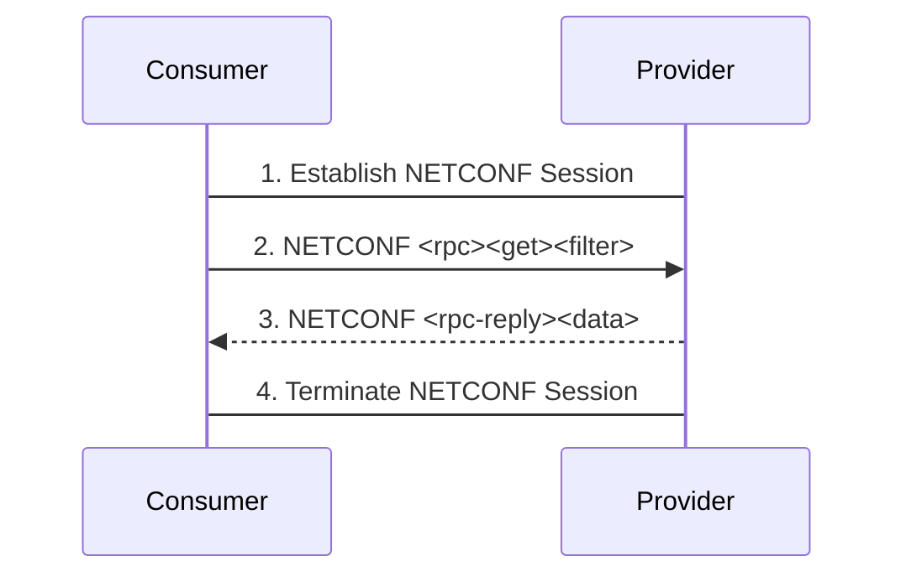
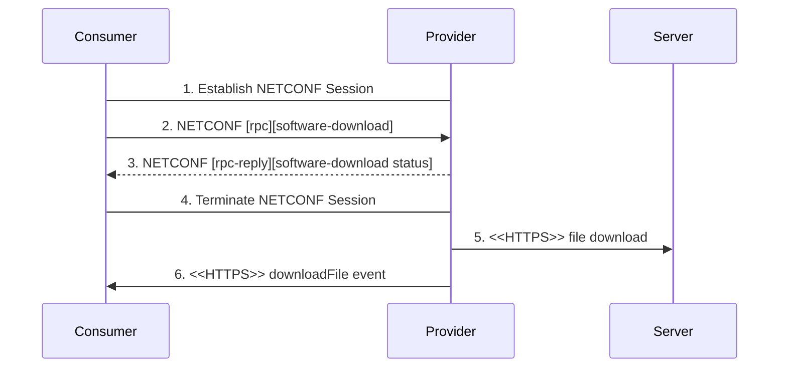
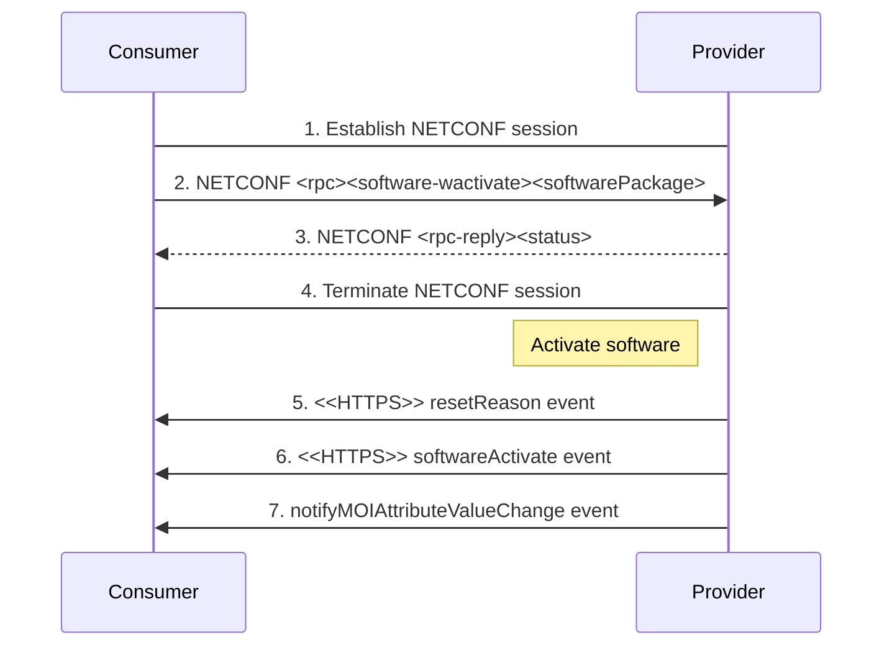

## 2.3. PNF Software Management Services
Software management services allow a PNF Software MnS *Consumer* to request a physical PNF Software MnS *Provider* to download, install, validate and activate a new software package and allow a physical PNF Software MnS *Provider* to report its software versions.

### 2.3.1. Software Inventory
The PNF Startup and Registration MnS *Consumer* sends a Software Inventory Request and retrieves information about the software packages on the PNF Software MnS *Provider*.

Procedure:
- PNF Software MnS *Consumer* establishes NETCONF session with PNF Software MnS *Provider*.
- The NETCONF session has read privileges into the identified section of the data store.
- PNF Software MnS *Consumer* sends NETCONF [rpc][get][filter] to retrieve a filtered subset configuration from the running datastore.
- PNF Software MnS *Provider* returns requested data.
- PNF Software MnS *Consumer* termintes NETCONF session.

### 2.3.2. Software Download
Software Download triggers the download and the installation of a specific software package to the PNF Software MnS *Provider*.

Procedure:
- PNF Software MnS *Consumer* establishes NETCONF session with PNF Software MnS *Provider*.
- The NETCONF session has read privileges into the identified section of the data store.
- PNF Software MnS *Consumer* sends NETCONF [rpc][software-download][remote-filepath][softwarePackage] to trigger a download.
- PNF Software MnS *Provider* validates the request and returns NETCONF [rpc-reply][software-download-status].
- PNF Software MnS *Consumer* terminates NETCONF session.
- PNF Software MnS *Provider* initiates SFTP, FTPES or HTTPS connection and downloads the software package from remoteFilePath.
- When download operation completes, PNF Software MnS *Provider* sends downloadFile event notification to PNF Software MnS *Consumer* with the final status of the download.

### 2.3.3. Software Activate
PNF Software MnS *Consumer* triggers the activation of a software package (including data migration and reset if needed) on the PNF Software MnS *Provider*.

Procedure:
- PNF Software MnS *Consumer* establishes NETCONF session with PNF Software MnS *Provider*.
- PNF Software MnS Consumer sends NETCONF [rpc][software-activate][softwarePackage] to trigger an activation of the software in softwarePackage.
- PNF Software MnS *Provider* returns status to the PNF Software MnS *Consumer*.
- PNF Software MnS Consumer terminates NETCONF session.
- After activation operation completes, PNF Software MnS *Provider* sends a softwareActivate notification.
- PNF Software MnS *Provider* sends notifyMOIAttributeValueChange to the PNF MnS *Consumer* updating the active software running on the PNF.

# References
- [O-RAN.WG3.O1-Interface-for-Near-RT-RIC-R003-v01.00](https://orandownloadsweb.azurewebsites.net/specifications)
- [O-RAN.WG5.O-DU-O1.0-R003-v07.00](https://orandownloadsweb.azurewebsites.net/specifications)
- [O-RAN.WG5.O-CU-O1.0-R003-v05.00](https://orandownloadsweb.azurewebsites.net/specifications)
- [O-RAN.WG10.O1-Interface.0-R003-v10.00](https://orandownloadsweb.azurewebsites.net/specifications)
- [O-RAN.WG10.OAM-Architecture-R003-v09.00](https://orandownloadsweb.azurewebsites.net/specifications)
- [3GPP TS 28.537 version 17.2.0 Release 17](https://www.etsi.org/deliver/etsi_ts/128500_128599/128537/17.02.00_60/ts_128537v170200p.pdf)
- [3GPP TS 28.532 version 16.4.0 Release 16](https://www.etsi.org/deliver/etsi_ts/128500_128599/128532/16.04.00_60/ts_128532v160400p.pdf)
- [3GPP TS 28.545 version 16.1.0 Release 16](https://www.etsi.org/deliver/etsi_ts/128500_128599/128545/16.01.00_60/ts_128545v160100p.pdf)
