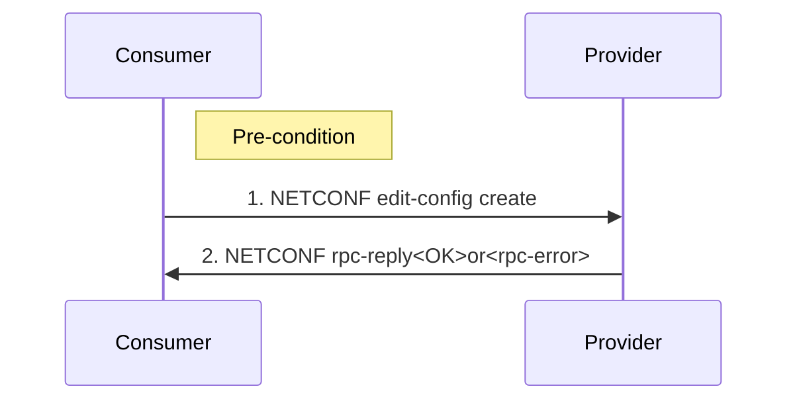
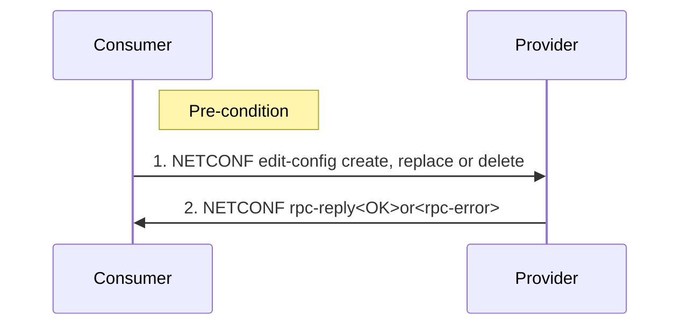
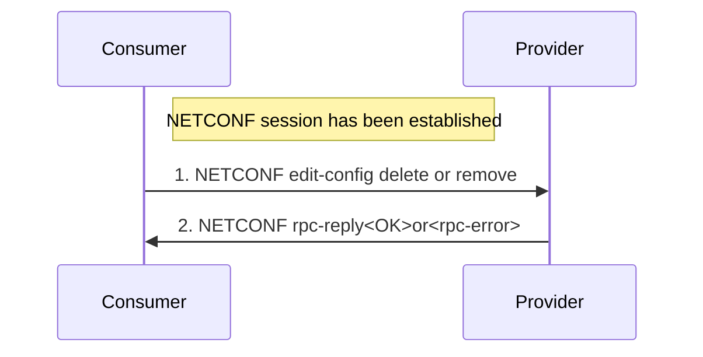
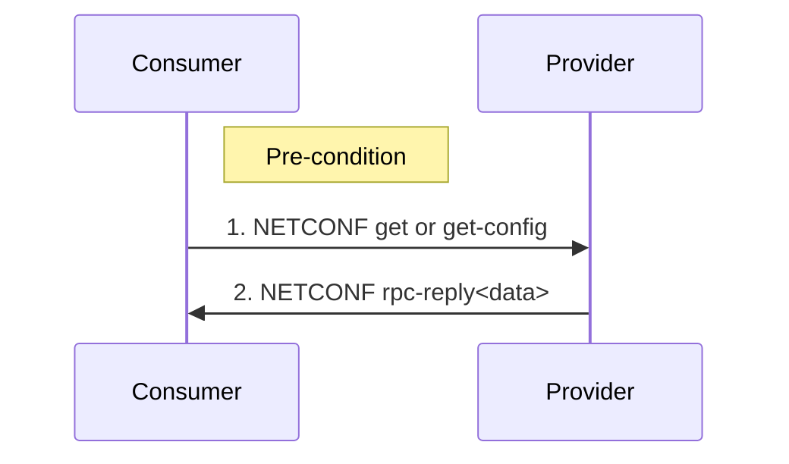
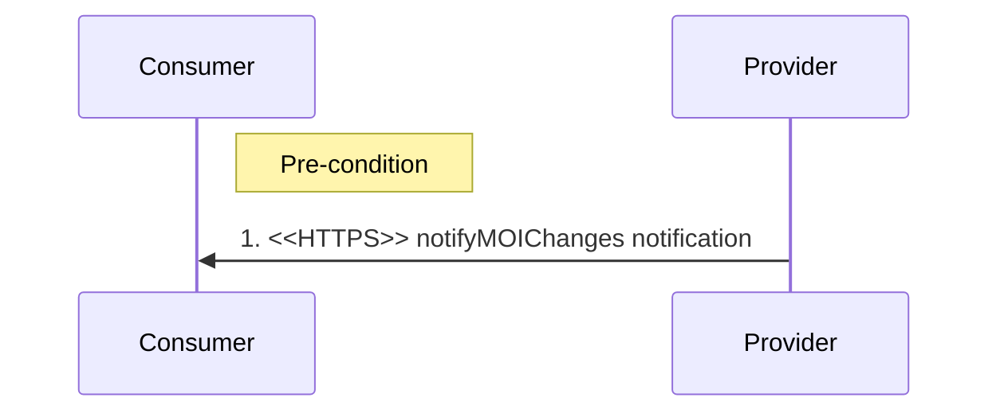
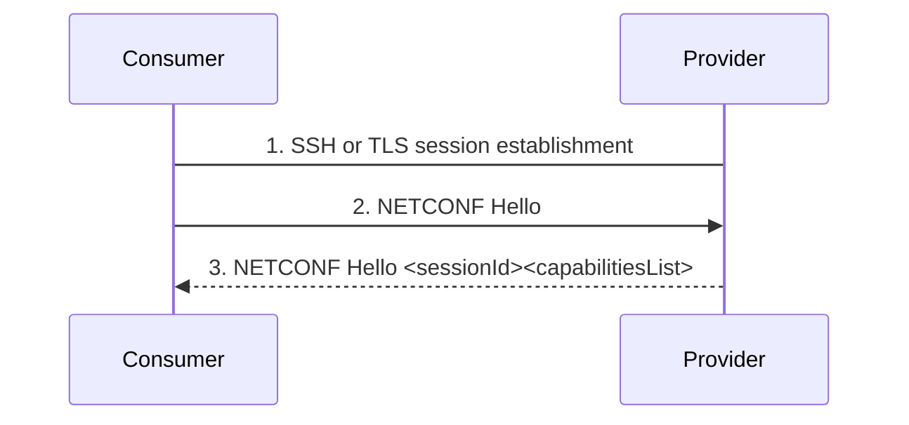
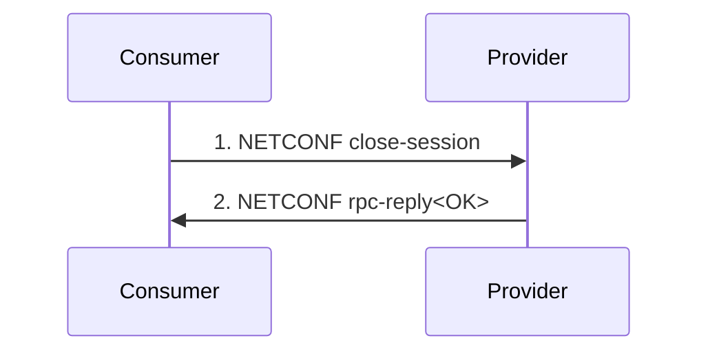
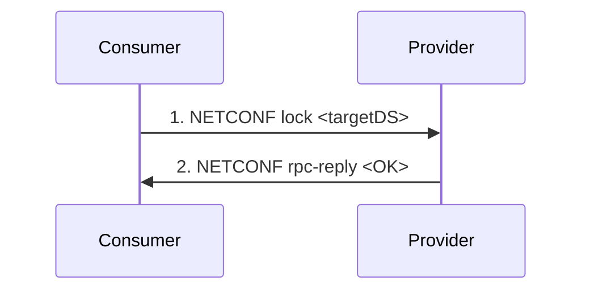
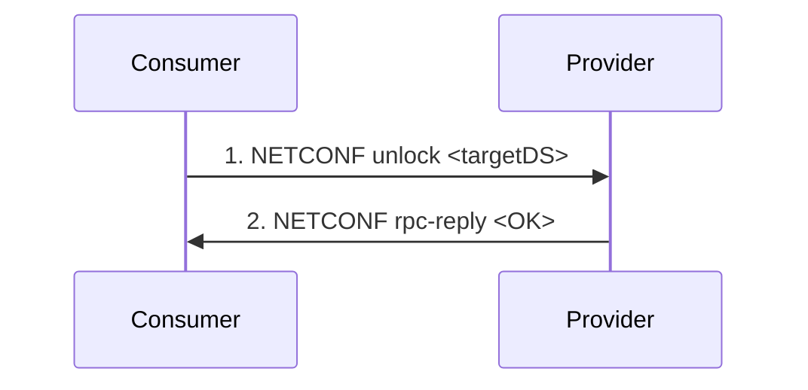
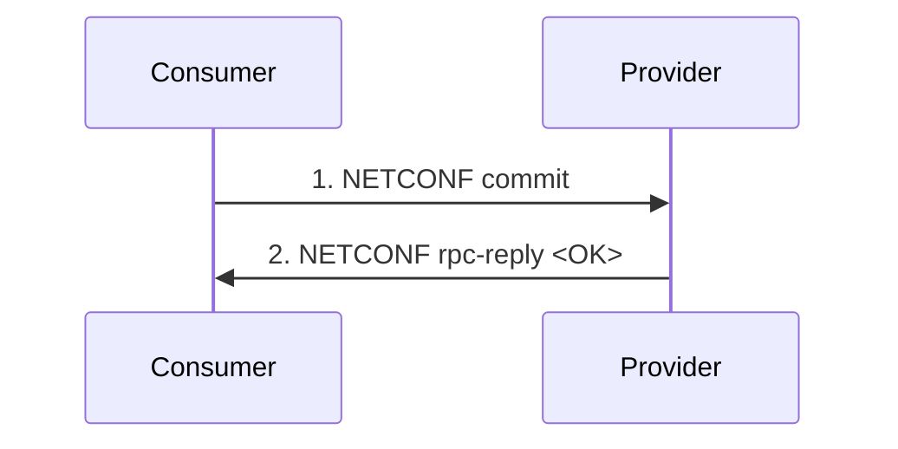

## 2.6. Provisioning Management Services

### 2.6.1. Create Managed Object Instance
Provisioning MnS *Consumer* sends a synchronous provisioning update request to the Provisioning MnS *Provider* to create a Managed Object Instance (MOI) on the Provisioning MnS *Provider*.

Pre-condition:
- NETCONF session has been established.

Procedure:
- Provisioning MnS *Consumer* sends NETCONF edit-config create operation to Provisioning MnS *Provider*.
- Provisioning MnS *Provider* returns NETCONF response.

### 2.6.2. Modify Managed Object Instance Attreibutes
Provisioning MnS *Consumer* sends synchronous provisioning updates to the Provisioning MnS *Provider* to modify the attributes of a MOI on the Provisioning MnS *Provider*.

Pre-condition:
- NETCONF session has been established

Procedure:
- Provisioning MnS *Consumer* sends NETCONF edit-config create, replace, or delete operation to Provisioning MnS *Provider*.
- Provisioning MnS *Provider* returns NETCONF response.

### 2.6.3. Delete Managed Object Instance
Provisioning MnS *Consumer* sends synchronous provisioning updates to the Provisioning MnS *Provider* to delete a MOI and its children on the Provisioning MnS *Provider*.

Pre-condition:
- NETCONF session has been established

Procedure:
- Provisioning MnS *Consumer* sends NETCONF edit-config delete or remove operation to Provisioning MnS *Provider*.
- Provisioning MnS *Provider* returns NETCONF response.

### 2.6.4. Read Managed Object Instance Attributes
Provisioning MnS *Consumer* sends synchronous provisioning request to the Provisioning MnS *Provider* to return the values of attributes of its MOI(s) on the Provisioning MnS *Provider*.

Pre-condition:
- NETCONF session has been established

Procedure:
- Provisioning MnS *Consumer* sends NETCONF get or get-config operation to Provisioning MnS *Provider*.
- Provisioning MnS *Provider* returns the data in the NETCONF response.

### 2.6.5. Notify Managed Object Instance Changes
Provisioning MnS *Provider* sends an asynchronous notifyMOIChanges Notification to the Provisioning MnS *Consumer* to report configuration changes to one or more MOIs on the Provisioning MnS *Provider*.

Pre-condition:
- One or more MOIs are created, deleted or modified in the running data store of the Provisioning MnS *Provider*.
- Provisioning MnS *Consumer* has subscribed for notifyMOIChanges notifications.

Procedure:
- Provisioning MnS *Provider* sends notifyMOIChanges notification to the Provisioning MnS Consumer over HTTP/TLS.

### 2.6.6. NETCONF Session Establishment
Provisioning MnS *Consumer* uses the NETCONF Session Establishment procedure to establish a NETCONF session on the Provisioning MnS *Provider*.

### 2.6.7. NETCONF Session Termination
Provisioning MnS *Consumer* uses the NETCONF Session Termination procedure to terminate a NETCONF session on a Provisioning MnS *Provider*.

### 2.6.8. Lock Data Store (DS)
Provisioning MnS *Consumer* uses the Lock Data Store procedure to lock a target data store on a Provisioning MnS *Provider*.

### 2.6.9. Unlock Data Store (DS)
Provisioning MnS *Consumer* uses the Unlock Data Store procedure to unlock a target data store on a Provisioning MnS *Provider*.

### 2.6.10. Commit
Provisioning MnS *Consumer* uses the Commit procedure to commit a configuration change to the running data store of the Provisioning MnS *Provider*.

# References
- [O-RAN.WG3.O1-Interface-for-Near-RT-RIC-R003-v01.00](https://orandownloadsweb.azurewebsites.net/specifications)
- [O-RAN.WG5.O-DU-O1.0-R003-v07.00](https://orandownloadsweb.azurewebsites.net/specifications)
- [O-RAN.WG5.O-CU-O1.0-R003-v05.00](https://orandownloadsweb.azurewebsites.net/specifications)
- [O-RAN.WG10.O1-Interface.0-R003-v10.00](https://orandownloadsweb.azurewebsites.net/specifications)
- [O-RAN.WG10.OAM-Architecture-R003-v09.00](https://orandownloadsweb.azurewebsites.net/specifications)
- [3GPP TS 28.537 version 17.2.0 Release 17](https://www.etsi.org/deliver/etsi_ts/128500_128599/128537/17.02.00_60/ts_128537v170200p.pdf)
- [3GPP TS 28.532 version 16.4.0 Release 16](https://www.etsi.org/deliver/etsi_ts/128500_128599/128532/16.04.00_60/ts_128532v160400p.pdf)
- [3GPP TS 28.545 version 16.1.0 Release 16](https://www.etsi.org/deliver/etsi_ts/128500_128599/128545/16.01.00_60/ts_128545v160100p.pdf)
