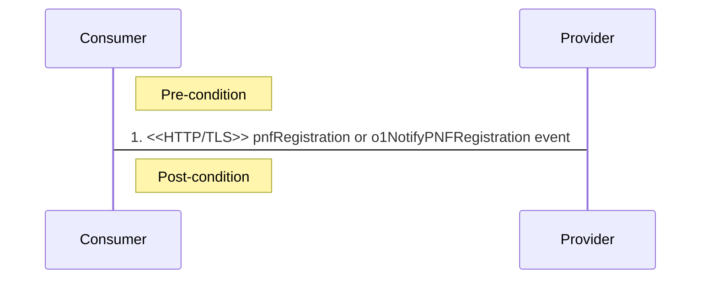

## 2.1. PNF Startup and Registration Management Services
### 2.1.1. PNF Plug-n-Connect (PnC)
PNF PnC scenario enables a PNF Startup and Registration MnS *Provider* to obtain the necessary start up configuration to allow it to register with PNF Startup and Registration MnS *Consumer* for subsequent management.

Plug-n-Connect is a list of procedure for connecting the Network Element to the management system. The details about concept, procedure, and data format can be found in the following documents:
- [PnC Concepts and Requirements](https://www.etsi.org/deliver/etsi_ts/128300_128399/128314/17.00.00_60/ts_128314v170000p.pdf)
- [PnC Procedure](https://www.etsi.org/deliver/etsi_ts/128300_128399/128315/17.00.00_60/ts_128315v170000p.pdf)
- [PnC Data Formats](https://www.etsi.org/deliver/etsi_ts/128300_128399/128316/17.00.00_60/ts_128316v170000p.pdf)

### 2.1.2. PNF Registration
PNF Startup and Registration MnS *Provider* sends an asynchronous pnfRegistration or o1NotifyPNFRegistration event to a PNF Startup and Registration MnS *Consumer* after PnC to notify the *Consumer* of *Provider* to be managed.

Pre-condition:
- PNF completes Plug-n-Connect (PnC).

Procedure:
- PNF Startup and Registration MnS *Provider* sends pnfRegistration or o1NotifyPNFRegistration notification event to PNF Startup and Registration MnS *Consumer* over HTTP/TLS.

Post-condition:
- PNF Startup and Registration MnS *Consumer* registers the PNF Startup and Registration MnS *Provider* so that it can be managed.

The following table describes the parameters of o1NotifyPnfRegistration event:

| Parameter Name | Support Qualifier | Information Type |
| -------- | :--------: | -------- |
| objectClass | M | ManagedEntity.objectClass |
| objectInstance | M | ManagedEntity.objectInstance |
| notificationId | M | NotificationId |
| notificationType | M | "o1NotifyPnfRegistration" |
| eventTime | M | Date Time |
| systemDN | M | SystemDN |
| o1SpecVersion | M | number |
| serialNumber | M | string |
| vendorName | M | string |
| oamV4IpAddress | CM | string |
| oamV6IpAddress | CM | string |
| macAddress | O | string |
| unitFamily | O | string |
| unitType | O | string |
| modelNumber | O | string |
| softwareVersion | O | string |
| restartReason | O | string |
| manufactureDate | O | string |
| lastServiceDate | O | string |
| macAddress | O | hashMap |

# References
- [O-RAN.WG3.O1-Interface-for-Near-RT-RIC-R003-v01.00](https://orandownloadsweb.azurewebsites.net/specifications)
- [O-RAN.WG5.O-DU-O1.0-R003-v07.00](https://orandownloadsweb.azurewebsites.net/specifications)
- [O-RAN.WG5.O-CU-O1.0-R003-v05.00](https://orandownloadsweb.azurewebsites.net/specifications)
- [O-RAN.WG10.O1-Interface.0-R003-v10.00](https://orandownloadsweb.azurewebsites.net/specifications)
- [O-RAN.WG10.OAM-Architecture-R003-v09.00](https://orandownloadsweb.azurewebsites.net/specifications)
- [3GPP TS 28.537 version 17.2.0 Release 17](https://www.etsi.org/deliver/etsi_ts/128500_128599/128537/17.02.00_60/ts_128537v170200p.pdf)
- [3GPP TS 28.532 version 16.4.0 Release 16](https://www.etsi.org/deliver/etsi_ts/128500_128599/128532/16.04.00_60/ts_128532v160400p.pdf)
- [3GPP TS 28.545 version 16.1.0 Release 16](https://www.etsi.org/deliver/etsi_ts/128500_128599/128545/16.01.00_60/ts_128545v160100p.pdf)
