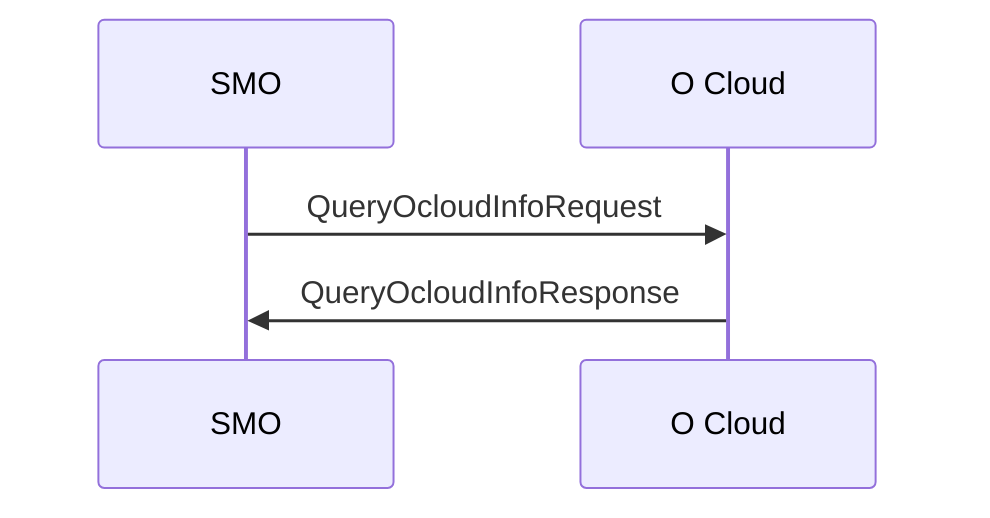
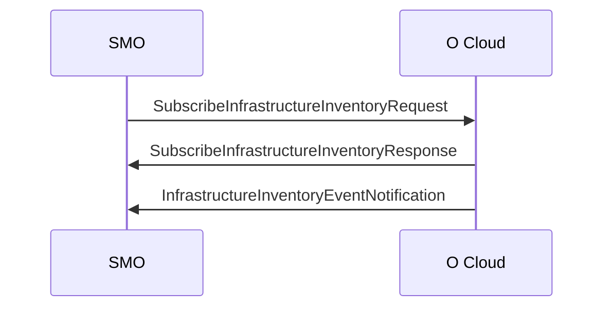
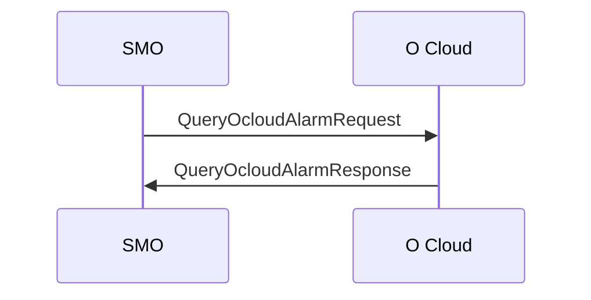
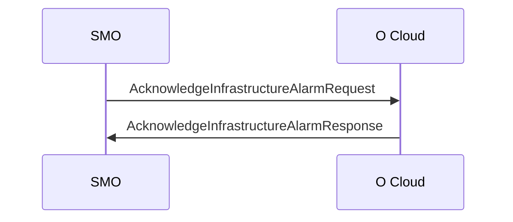
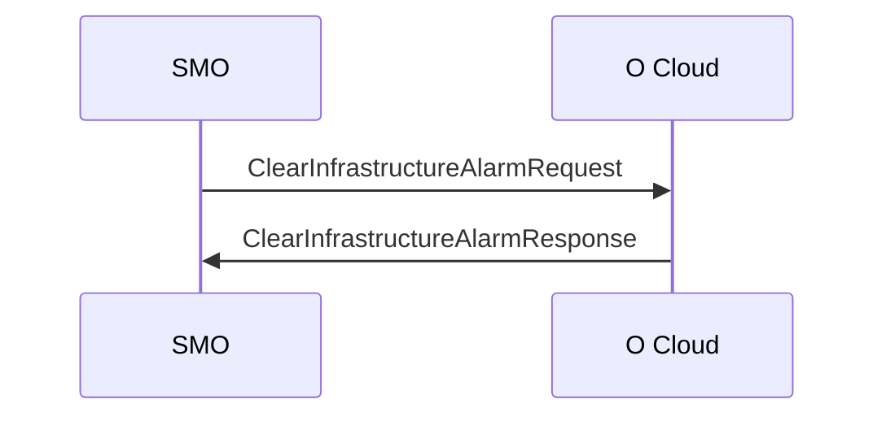
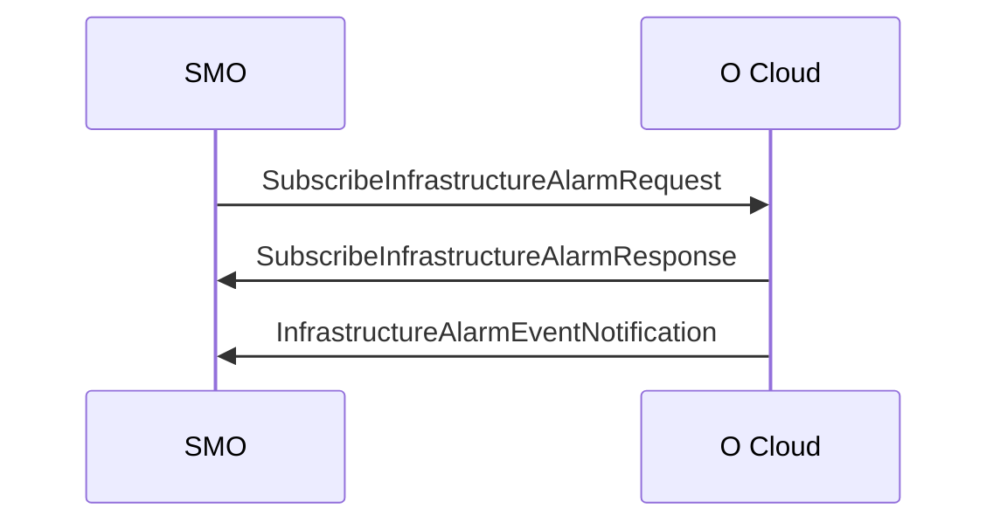
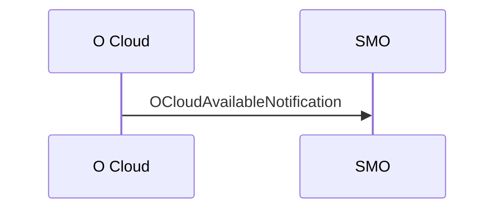

# 2. O2ims Services
The table below summarizes the corresponding O2ims services

| Service Name | Description |
| -------- | -------- | 
| O2ims_InfrastructureInventory Services | Service for querying the O-Cloud resources and management services | 
| O2ims_InfrastructureMonitoring Services | Service for configuring telemetry reporting of O-Cloud infrastructure resourcces |
| O2ims_InfrastructureProvisioning Services | Service for configuring the O-Cloud infrastructure resources and management services |
| O2ims_InfrastructureSoftwareManagement Services | Service for software inventory and updating the software used for O-Cloud infrastructure resources and management services | 
| O2ims_InfrastructureLifecycleManagement Services | Service related to O-Cloud infrastructure lifecycle management and events | 

\
The table below lists the versions of the corresponding APIs

| API | API Version |
| -------- | -------- | 
| O2ims_InfrastructureInventory Service API | 1.0.0 |
| O2ims_InfrastructureMonitoring Service API | 1.0.0 |
| O2ims_InfrastructureProvisioning Service API | *To be Determined* |
| O2ims_InfrastructureSoftwareManagement Service API | *To be Determined* |
| O2ims_InfrastructureLifecycleManagement Service API | *To be Determined* |

\
Protocol Stack
| HTTP |
| :--------: |
| **TLS** |
| **TCP** |
| **IP** |
| **Data Link Layer** |
| **Physical Layer** |

\
The URI (Uniform Resource Identifier) structure that used in HTTP request from the API *service consumer* towards the API *service producer*:
```
{apiRoot}/<apiName>/<apiMajorVersion>/<apiSpecificResourceUriPart>
```
with the following component:
- The ```{apiRoot}``` inidicates the scheme ("https"), the host name, and optional port.
- The ```apiName``` indicated the API name of the service interface.
- The ```apiMajorVersion``` indicates the current major version of the API.
- The ```apiSpecificResourceUriPart``` indicates a resource URI of the API.

## 2.1. O-Cloud Inventory
The O-Cloud Inventory consists of the O-Cloud resources, the logical clouds, and the inventory of deployment using the logical cloud. O-Cloud inventory is the result of the SMO provisioning requests and assignments of O-Cloud Resources, and status of the O-Cloud internal resources.

### 2.1.1. O2ims_InfrastructureInventory Services
The O2ims_InfrastructureInventory services has operations on the following managed service objects that are provided by the O-Cloud:
- *O-Cloud* represents an instance of an O-Cloud.
- *ResourceType* represents a resource type in an O-Cloud.
- *ResourcePool* represents a resource pool instance in an O-Cloud.
- *Resource* represents an instance of a resource in the O-Cloud.
- *DeploymentManager* represent an instance  of a DMS in the O-Cloud.
- *Subscription* represents an instance of a subscription to infrastructure inventory notifications for when resources within the inventory change.

\
**Query O-Cloud Information Operation**


**O-Cloud Inventory Event Notifications Operation**

### 2.1.2. O2ims_InfrastructureInventory Service API
The operations defined for O2ims_InfrastructureInventory Services through this API are:
- Query information about one or multiple Resource Type
- Query information about one or multiple Resource Pool
- Query information about one or multiple Resource
- Query information about one or multiple Deployment Manager
- Query information about one or multiple Subscriptions

\
The figure below shows the resource URI structure defined for the O2ims_InfrastructureInventory Service API


#### **a. O-Cloud Description**
- URI: ```/```

| HTTP Method | Description | 
| -------- | -------- |
| POST | *not supported* | 
| GET | To get the attributes of the O-Cloud instance | 
| PUT | *not supported* | 
| PATCH | *not supported* | 
| DELETE | *not supported* | 

For not supported methods, O-Cloud shall return a "405 Method Not Allowed" response.

#### **b. Resource Type List** 
- URI: ```/resourceTypes```

| HTTP Method | Description | 
| -------- | -------- |
| POST | *not supported* | 
| GET | To get a list of resource types | 
| PUT | *not supported* | 
| PATCH | *not supported* | 
| DELETE | *not supported* | 

For not supported methods, O-Cloud shall return a "405 Method Not Allowed" response.

#### **c. Resource Type Description**
- URI: ```/resourceTypes/{resourceTypeId}```

| HTTP Method | Description | 
| -------- | -------- |
| POST | *not supported* | 
| GET | To get an individual resource type description | 
| PUT | *not supported* | 
| PATCH | *not supported* | 
| DELETE | *not supported* | 

For not supported methods, O-Cloud shall return a "405 Method Not Allowed" response.

#### **d. Resource Pool List**
- URI: ```/resourcePools```

| HTTP Method | Description | 
| -------- | -------- |
| POST | *not supported* | 
| GET | To get a list of resource pools | 
| PUT | *not supported* | 
| PATCH | *not supported* | 
| DELETE | *not supported* | 

For not supported methods, O-Cloud shall return a "405 Method Not Allowed" response.

#### **e. Resource Pool Description**
- URI: ```/resourcePools/{resourcePoolId}```

| HTTP Method | Description | 
| -------- | -------- |
| POST | *not supported* | 
| GET | To get an individual resource pool description | 
| PUT | *not supported* | 
| PATCH | *not supported* | 
| DELETE | *not supported* | 

For not supported methods, O-Cloud shall return a "405 Method Not Allowed" response.

#### **f. Resource List**
- URI: ```/resourcePools/{resourcePoolId}/resources```

| HTTP Method | Description | 
| -------- | -------- |
| POST | *not supported* | 
| GET | To get a list of resources in the resource pool | 
| PUT | *not supported* | 
| PATCH | *not supported* | 
| DELETE | *not supported* | 

For not supported methods, O-Cloud shall return a "405 Method Not Allowed" response.

#### **g. Resource Description**
- URI: ```/resourcePools/{resourcePoolId}/resources/{resourceId}```

| HTTP Method | Description | 
| -------- | -------- |
| POST | *not supported* | 
| GET | To get an individual resouce description | 
| PUT | *not supported* | 
| PATCH | *not supported* | 
| DELETE | *not supported* | 

For not supported methods, O-Cloud shall return a "405 Method Not Allowed" response.

#### **h. Deployment Manager List**
- URI: ```/deploymentManagers```

| HTTP Method | Description | 
| -------- | -------- |
| POST | *not supported* | 
| GET | To get a list of deployment managers | 
| PUT | *not supported* | 
| PATCH | *not supported* | 
| DELETE | *not supported* | 

For not supported methods, O-Cloud shall return a "405 Method Not Allowed" response.

#### **i. Deployment Manager Description**
- URI: ```/deploymentManagers/{deploymentManagerId}```

| HTTP Method | Description | 
| -------- | -------- |
| POST | *not supported* | 
| GET | To get an individual deployment manager description | 
| PUT | *not supported* | 
| PATCH | *not supported* | 
| DELETE | *not supported* | 

For not supported methods, O-Cloud shall return a "405 Method Not Allowed" response.

#### **j. Inventory Subscription List**
- URI: ```/subscriptions```

| HTTP Method | Description | 
| -------- | -------- |
| POST |  To create an individual subscription | 
| GET | To get a list of subscriptions | 
| PUT | *not supported* | 
| PATCH | *not supported* | 
| DELETE | *not supported* | 

For not supported methods, O-Cloud shall return a "405 Method Not Allowed" response.

#### **k. Inventory Subscription Description**
- URI: ```/subscriptions/{subscriptionId}```

| HTTP Method | Description | 
| -------- | -------- |
| POST | *not supported* | 
| GET | To get an individual subscription description | 
| PUT | *not supported* | 
| PATCH | *not supported* | 
| DELETE | To delete an individual subscription | 

For not supported methods, O-Cloud shall return a "405 Method Not Allowed" response.

## 2.2. O-Cloud Monitoring Service
The O-Cloud Monitoring Service uses telemetry data to provide monitoring of O-Cloud insfrastructures:
- **Managed Element Telemetry:** to monitor the application behaviour.
- **Deployment Telemetry:** to monitor the number of O-Cloud deployment instances, deployment progress, and health checks progress.
- **Infrastructure Telemetry:** to monitor the health of the O-Cloud Infrastructure components.

### 2.2.1. O2ims_InfrastructureMonitoring Services
The O2ims_InfrastructureMonitoring services has operations on the following managed service objects that are provided by the O-Cloud for faults:
- *AlamrEventRecord* represents a stored instance detected within the O-Cloud Resources and stored by the IMS.
- *ProbableCauses* provides further qualification for the root cause of an alarm.
- *Subscriptions* represents an instance of a subscription to infrastructure fault notifications for when qualifying alarm list entry changes occur.

\
**Query Alarm Information Operation**

**Infrastructure Alarm Acknowledge Operation**

**Infrastructure Alarm Clear Operation**

**Infrastructure Alarm Event Notifications Operation**


### 2.2.2. O2ims_InfrastructureMonitoring Service API
The operations defined for O2ims_InfrastructureMonitoring Services through this API are:
- Query information about one or multiple alarms
- Create a subscription to alarms of interest

The figure below shows the resource URI structure defined for the O2ims_InfrastructureMonitoring Service API


#### **a. Alarm List** 
- URI: ```/alarms```

| HTTP Method | Description | 
| -------- | -------- |
| POST | *not supported* | 
| GET | To get a list of alarms | 
| PUT | *not supported* | 
| PATCH | *not supported* | 
| DELETE | *not supported* | 

For not supported methods, O-Cloud shall return a "405 Method Not Allowed" response.
 
#### **b. Alarm Record** 
- URI: ```/alarms/{alarmEventRecordId}```

| HTTP Method | Description | 
| -------- | -------- |
| POST | *not supported* | 
| GET | To get an individual alarm record | 
| PUT | *not supported* | 
| PATCH | *not supported* | 
| DELETE | *not supported* | 

For not supported methods, O-Cloud shall return a "405 Method Not Allowed" response.

#### **c. Alarm Subscription List** 
- URI: ```/alarmSubscriptions```

| HTTP Method | Description | 
| -------- | -------- |
| POST | To create an individual alarm subscription | 
| GET | To get a list of alarm subscriptions | 
| PUT | *not supported* | 
| PATCH | *not supported* | 
| DELETE | *not supported* | 

For not supported methods, O-Cloud shall return a "405 Method Not Allowed" response.

#### **d. Alarm Subscription Description** 
- URI: ```/alarmSubscriptions/{alarmSubscriptionId}```

| HTTP Method | Description | 
| -------- | -------- |
| POST | *not supported* | 
| GET | To get an individual alarm subscription description | 
| PUT | *not supported* | 
| PATCH | *not supported* | 
| DELETE | To delete an individual alarm subscription | 

For not supported methods, O-Cloud shall return a "405 Method Not Allowed" response.

## 2.3. O-Cloud Provisioning
O-Cloud provisioning is the allocation and configuration of O-Cloud resources and services to *O-Cloud Node*, *Node Group*, *Node Cluster Network*, *Node Cluster* and/or *Logical Cloud*. To support the deployment, O-Cloud Provisioning will need to provide several functionalities:
- **Affinity Rule.** It specifies that deployments with the same rule applied must be located within the same scope.
- **Anti-Affinity Rule.** It specifies that deployments with the same rule applied cannot be located within the same scope. 
- **Quorum Diversity Rule.** It specifies that deployments with this rule can be located if less than 50% of the deployments exist within the same scope.
- **Capacity Query.** The O-Cloud Capacity is the number of exposed O-Cloud Resources of each ResourceType that can be allocated or reserved for O-Cloud Node Clusters.
- **Availability Query.** The O-Cloud Availability is the currently free number of exposed O-Cloud Resources of each ResourceType that is not allocated or reserved. 
- **Managed O-Cloud Node Cluster and Logical Clouds.**

### 2.3.1. O2ims_InfrastructureProvisioning Services
*For Further Study*
### 2.3.2. O2ims_InfrastructureProvisioning Service API
*For Further Study*

## 2.4. O-Cloud Software Management
Software Management ensures security, cost management, and software support. The benefits of Sotware Management are:
- Prevents unauthorized software from being installed
- Maintains a catalog of authorized software and its versions
- Provides visibility into what software and version is being used
- Provides a better view of which software products and versions are vendor supported

From an O-Cloud perspective, there are two types of software which needs to be managed on the O2 interface:
- The O-Cloud Infrastructure Software
- The O-RAN Cloudified Network Function Software is the software implementation of O-RAN NFs which is capable of running over the O-Cloud

### 2.4.1. O2ims_InfrastructureSoftwareManagement Services
*For Further Study*
### 2.4.2. O2ims_InfrastructureSoftwareManagement Service API
*For Further Study*

## 2.5. O-Cloud Life Cycle Management
The goal of O-Cloud Life Cycle Management is to reduce deployment cost and complexity by orchestrating the deployment and management of the O-Clouds.

The O-Cloud Life Cycle Management will provide the following capabilities:
- **Deploy.** The objective of deployment is to provide automated provisioning of the O-Cloud Infrastructure.
- **Registration.** The objective of registration is to register an O-Cloud and make it available for deployment.
- **Scale.** *For Further Study*.

### 2.5.1. O2ims_InfrastructureLifecycleManagement Services
The O2ims_InfrastructureLifecycleManagement services has operations on the following managed service objects that are interest to the SMO:
- *O-Cloud* represents an instance of an O-Cloud within the SMO.
- *DeploymentManager* represents an instance of a DMS in an O-Cloud that has been registered and discovered from the O-Cloud Infrastructure Inventory.
- *Location* represents a location where assets can be deployed.
- *Asset* represents an asset purchased or leased by the operator.

**O-Cloud Available Event Notification Operation**


### 2.5.2. O2ims_InfrastructureLifecycleManagement Service API
*For Further Study*

# References
- [O-RAN.WG6.O2-GA&P-R003-v04.00](https://orandownloadsweb.azurewebsites.net/specifications)
- [O-RAN.WG6.O2IMS-INTERFACE-R003-v04.00](https://orandownloadsweb.azurewebsites.net/specifications)
- [O-RAN.WG6.O2DMS-INTERFACE-K8S-PROFILE-R003-v03.00](https://orandownloadsweb.azurewebsites.net/specifications)
- [O-RAN.WG6.O2DMS-INTERFACE-ETSI-NFV-PROFILE-R003-v04.00](https://orandownloadsweb.azurewebsites.net/specifications)
